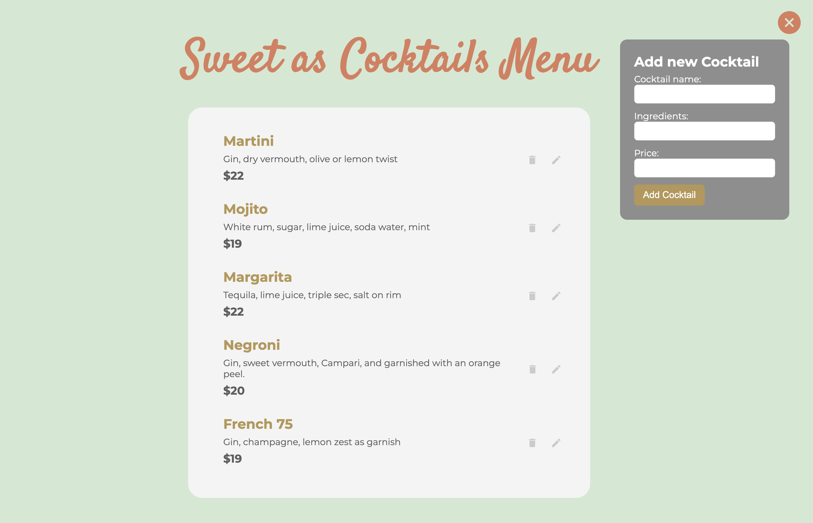
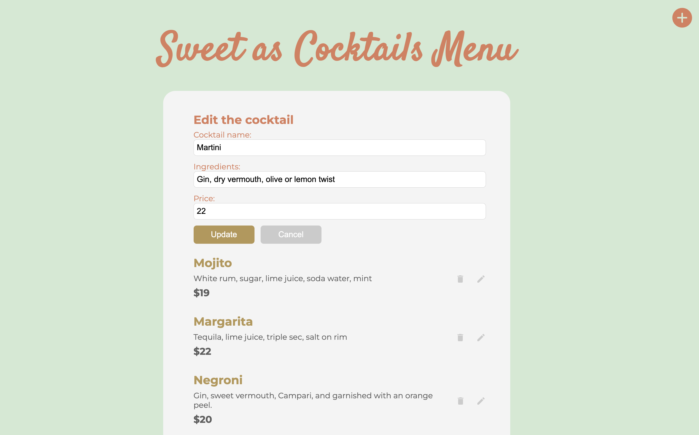

# Sweet as Cocktail

**Sweet as Cocktail** is the first full-stack web application that I developed during my study in Dev Academy. It is designed for restaurants to manage their cocktail menu. The application allows users to create, read, update, and delete (CRUD) cocktail menu items. The project uses React for the frontend and Node.js for the backend, following a structured and layered architecture. The frontend communicates with the backend through an API layer.

## Recent Updates

**Front-end UI**: I've upgraded the front-end user interface by utilizing SASS, enhancing both the visual aesthetics and responsiveness of the application.




<br>

**Codebase Refactoring**: When reviewing of the React codebase that I initially wrote while studying, I noticed it was quite cluttered. I've refactored it by separating the code into components to improve readability and maintainability.

## Technologies Used

**Frontend**: React, Superagent, SASS, HTML

**Backend**: Node.js, Express.js, SQLite3, Knex

## Installation

#### **From the command line**

```
git clone https://github.com/tifff-wang/sweet-as-cocktails.git
```

```
cd sweet-as-cocktails
```

Install dependencies

```
npm i
```

Run migrations & seeds

```
npm run knex migrate:latest
npm run knex seed:run
```

To start the dev server

```
npm run dev
```

You can find the server running on [http://localhost:3000](http://localhost:3000) and the client running on [http://localhost:5173](http://localhost:5173).

## What's next?

**Error-handling**: When I look back to the backend of this project, I noticed a lack of comprehensive error handling, particularly when interacting with the database and handling HTTP requests and responses. Moving forward, I plan to focus on learning and enhancing the error handling in Node.js to make the application more maintainable and to provide a better user experience.

**Add generating menu feature**: I'm planning to introduce a new feature that allows users to customize their cocktail menu and download it as a PDF. I'm also exploring the potential of integrating AI to automatically generate styled menus that reflect users' preferred styles and logos.
